<!-- Profile Header with animated typing SVG -->

  

  

---

## 👨‍💻 About Me

- 🚀 Passionate Full Stack Developer  
- 🎯 Specializing in **Laravel, NestJS, React, TypeScript, C#, Java, Python**
- 💡 Lover of clean code, best practices, and modern UI/UX
- 🌱 Always learning new tech and exploring open source

---

## 🛠️ Tech Stack

  
  
  
  
  
  
  
  
  
  
  

---

## ⚡ Fun Facts & Highlights

- 🧙‍♂️ I believe in the magic of **clean code** and **continuous learning**
- 🧩 I enjoy solving puzzles—both on screen and on paper
- 🏆 Love collaborating on open source and hackathons
- 🎨 UI/UX matters! I love making interfaces intuitive and beautiful
- 🛠️ I automate workflows and build tools to make life easier

---

## 🎬 My Workflow

```mermaid
graph TD;
    A[Idea 💡] --> B[Research 🔎]
    B --> C[Design 🎨]
    C --> D[Code 💻]
    D --> E[Test 🧪]
    E --> F[Deploy 🚀]
    F --> G[Feedback 🔁]
    G --> B
```

---

## 📈 GitHub Stats

  
  

  

---

## 🌐 Connect with Me

  
  
  

---

  
📚 <b>Current Interests & What’s Next?</b>

- Microservices & Cloud-Native Apps (AWS, Docker, Kubernetes)
- Advanced TypeScript & React Patterns
- AI and Machine Learning
- Building developer tools and automation scripts

---

  

  <b>“Code is like humor. When you have to explain it, it’s bad.”</b>
   
  <i>— Cory House</i>

