<!-- 🧑‍💻 Header Typing Animation -->

  

<!-- 🧠 Avatar GIF -->

  

---

## 👨‍💻 About Me

Hi! I’m **John Michael Domingo**, a passionate **Full Stack Developer**, software engineer, and tech enthusiast currently pursuing my BSIT at **STI College Koronadal**.

🔭 Founder and architect of innovative software and IoT solutions.  
🛠️ Transforming ideas into scalable, real-world applications.  
🎯 Focused on agility, creativity, and efficiency.

---

## 🚀 Tech Stack & Tools

  <!-- Programming Languages -->
  
  
  
  
  
  
  
  
  
  

  <!-- Frameworks & UI -->
  
  
  
  
  
  

  <!-- Backend & DB -->
  
  
  
  
  

  <!-- DevOps & Tools -->
  
  
  
  
  

---

## 📊 Skills Overview

| Skill                    | Proficiency |
|--------------------------|-------------|
| PHP / Laravel            | 🔥 95%       |
| JavaScript / React       | 🚀 90%       |
| CSS / Tailwind / Bootstrap | ✨ 85%     |
| C# / WinForm             | 🔧 80%       |
| Python / Flask / Django  | 🧠 80%       |
| Java / Android Studio    | 📱 75%       |
| Mobile Dev (React Native)| 📲 85%       |
| MySQL / MSSQL / PostgreSQL | 💾 85%     |
| Firebase / Supabase      | ☁️ 80%       |
| Postman / Swagger        | 🛠️ 80%       |
| Photoshop / UI Design    | 🎨 85%       |
| IoT (Arduino, ESP32)     | 🌐 80%       |

---

## 🧩 Services I Offer

### 🌐 Web Development  
Modern, responsive, and optimized websites  
✔ UI/UX Design, ✔ SEO, ✔ Performance Boost

### 📱 Mobile App Development  
Custom Android/iOS apps using React Native & Java  
✔ API Integration, ✔ Push Notifications, ✔ Auth

### 🖥️ Software & Desktop Dev  
Secure, scalable desktop software  
✔ C#/WinForms, ✔ Database, ✔ Installer Packaging

### 🔌 IoT / Embedded Systems  
Smart automation with cloud integration  
✔ ESP32/Arduino, ✔ Sensors, ✔ Firebase/Supabase

### 🧠 AI & Biometric Solutions  
Advanced security using AI  
✔ Facial/Fingerprint Recognition, ✔ Machine Learning

### 🎨 Creative Design  
Custom graphics and digital art  
✔ Photoshop, ✔ UI Design, ✔ Branding

---

## 📈 GitHub Insights

  
  
  

---

## 🧠 My Workflow

```mermaid
graph TD;
    A[Brainstorm 🧠] --> B[Design 🎨]
    B --> C[Develop 💻]
    C --> D[Test 🧪]
    D --> E[Deploy 🚀]
    E --> F[Monitor 🔍]
    F --> A
```

---

## 🌍 Connect With Me

  
  
  

---

  

  <b>“Innovation is seeing what everybody has seen and thinking what nobody has thought.”</b> 
  <i>— Dr. Albert Szent-Györgyi</i>

